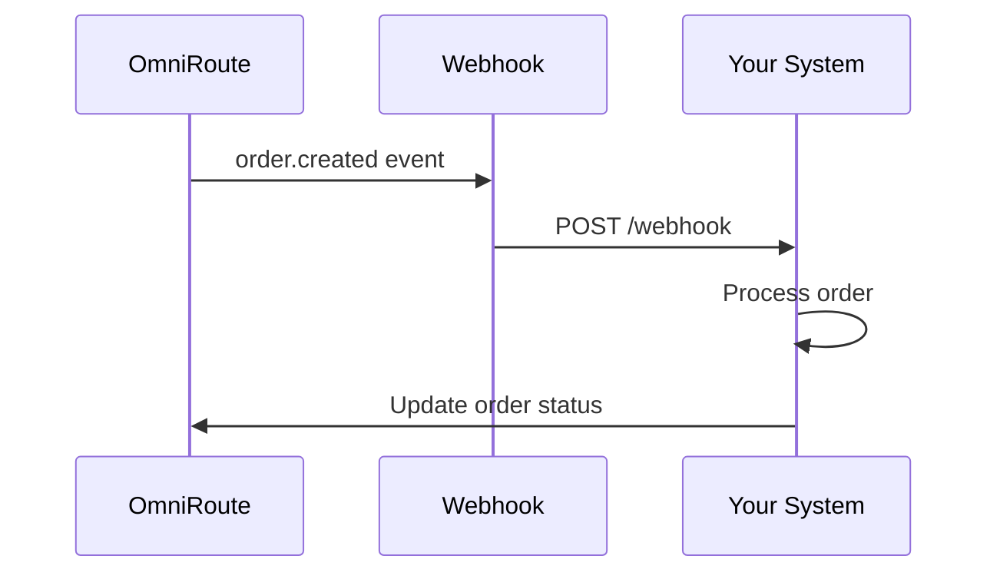
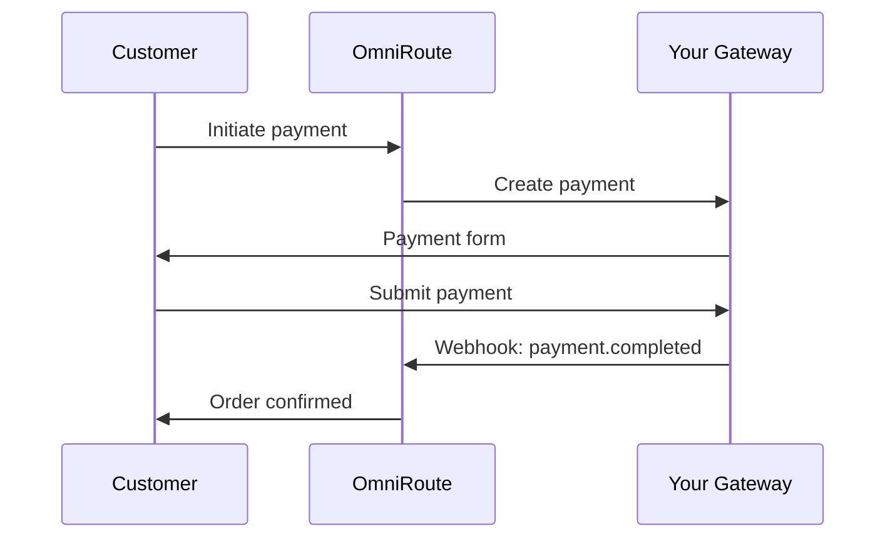

# OmniRoute Integration Guide
## Partner and Third-Party Integration Patterns

---

## Overview

This guide provides comprehensive documentation for integrating with the OmniRoute platform. Whether you're building a custom application, connecting an existing system, or creating a marketplace integration, this guide covers all integration patterns.

---

## Integration Options

| Method | Best For | Complexity |
|--------|----------|------------|
| **REST API** | Custom integrations, automation | Medium |
| **GraphQL API** | Complex queries, real-time data | Medium |
| **Webhooks** | Event-driven architectures | Low |
| **n8n Workflows** | No-code integrations | Low |
| **MCP Protocol** | AI/LLM integrations | Medium |
| **SDK Libraries** | Application development | Low |

---

## Quick Start Integration

### Step 1: Get API Credentials
1. Log in to the OmniRoute Developer Portal
2. Navigate to **Settings > API Keys**
3. Create a new API key with appropriate scopes
4. Store securely (never commit to version control)

### Step 2: Test Connection
```bash
curl -X GET "https://api.omniroute.io/v1/health" \
  -H "Authorization: Bearer YOUR_API_KEY"
```

**Expected Response:**
```json
{
  "status": "healthy",
  "version": "1.0.0",
  "timestamp": "2026-01-18T20:30:00Z"
}
```

### Step 3: Make Your First API Call
```bash
curl -X GET "https://api.omniroute.io/v1/orders?limit=5" \
  -H "Authorization: Bearer YOUR_API_KEY"
```

---

## Integration Patterns

### Pattern 1: Order Synchronization

**Use Case:** Sync orders from OmniRoute to your ERP/Accounting system



**Implementation:**
```javascript
// Webhook handler
app.post('/webhook/omniroute', (req, res) => {
  const { type, data } = req.body;
  
  if (type === 'order.created') {
    // Create order in ERP
    await erpClient.createOrder({
      externalId: data.order_id,
      customer: data.customer_name,
      total: data.total
    });
  }
  
  res.status(200).send('OK');
});
```

### Pattern 2: Inventory Sync

**Use Case:** Real-time inventory synchronization

```python
# Polling approach (for systems without webhook support)
import schedule

def sync_inventory():
    # Get inventory from external system
    external_inventory = erp.get_inventory()
    
    # Update OmniRoute
    for item in external_inventory:
        omniroute.inventory.update(
            product_id=item['sku'],
            quantity=item['qty'],
            warehouse_id='main'
        )

schedule.every(15).minutes.do(sync_inventory)
```

### Pattern 3: Payment Gateway Integration

**Use Case:** Custom payment provider integration



### Pattern 4: AI/LLM Integration via MCP

**Use Case:** Build AI-powered ordering assistant

```python
# Connect to OmniRoute MCP Server
from mcp import MCPClient

client = MCPClient("https://mcp.omniroute.io")

# List available tools
tools = client.tools.list()
# ['create_order', 'search_products', 'check_inventory', ...]

# Execute a tool
result = client.tools.call('search_products', {
    'query': 'indomie noodles',
    'limit': 10
})
```

---

## Webhook Configuration

### Setting Up Webhooks

1. Navigate to **Settings > Webhooks** in the Developer Portal
2. Click **Add Webhook Endpoint**
3. Configure:
   - **URL**: Your endpoint (must be HTTPS)
   - **Events**: Select events to subscribe to
   - **Secret**: Auto-generated signing secret

### Verifying Webhook Signatures

```python
import hmac
import hashlib

def verify_signature(payload, signature, secret):
    expected = hmac.new(
        secret.encode(),
        payload.encode(),
        hashlib.sha256
    ).hexdigest()
    return hmac.compare_digest(f"sha256={expected}", signature)
```

### Webhook Retry Policy

| Attempt | Delay |
|---------|-------|
| 1 | Immediate |
| 2 | 5 minutes |
| 3 | 30 minutes |
| 4 | 2 hours |
| 5 | 24 hours |

After 5 failed attempts, the endpoint is marked as unhealthy.

---

## n8n Workflow Integration

OmniRoute includes n8n for no-code workflow automation.

### Pre-Built Templates

| Template | Description |
|----------|-------------|
| Order to Slack | Notify Slack channel on new orders |
| Low Stock Alert | Email when inventory drops |
| Daily Sales Report | Scheduled sales email |
| Customer Sync | Sync customers to CRM |

### Creating Custom Workflows

1. Access n8n at `https://workflows.omniroute.io`
2. Use the **OmniRoute** node for triggers and actions
3. Available triggers:
   - Order Created
   - Payment Received
   - Inventory Updated
   - Shipment Status Changed

### Example: Order to Google Sheets

```json
{
  "nodes": [
    {
      "name": "Order Trigger",
      "type": "omniroute.orderTrigger",
      "parameters": {
        "event": "created"
      }
    },
    {
      "name": "Google Sheets",
      "type": "googleSheets",
      "parameters": {
        "operation": "append",
        "sheetId": "YOUR_SHEET_ID",
        "values": {
          "Order Number": "={{$json.order_number}}",
          "Customer": "={{$json.customer_name}}",
          "Total": "={{$json.total}}"
        }
      }
    }
  ]
}
```

---

## Common Integration Scenarios

### Scenario 1: E-commerce Platform Integration

**Shopify, WooCommerce, Magento**

1. Install OmniRoute connector app
2. Configure API credentials
3. Map product catalogs
4. Enable order sync
5. Configure inventory sync direction

### Scenario 2: Accounting System Integration

**QuickBooks, Xero, Sage**

1. Set up OAuth connection
2. Map chart of accounts
3. Configure invoice sync
4. Enable payment posting
5. Set up reconciliation rules

### Scenario 3: Logistics Integration

**DHL, FedEx, Local Carriers**

1. Add carrier credentials
2. Configure shipping methods
3. Enable label generation
4. Set up tracking webhooks
5. Configure returns handling

### Scenario 4: CRM Integration

**Salesforce, HubSpot, Zoho**

1. Connect via OAuth
2. Map customer fields
3. Sync contact information
4. Enable activity logging
5. Set up lead routing

---

## Data Mapping Guidelines

### Customer Fields

| OmniRoute Field | Common CRM Field |
|-----------------|------------------|
| `customer.name` | `Full Name`, `Account Name` |
| `customer.email` | `Email` |
| `customer.phone` | `Phone`, `Mobile` |
| `customer.company` | `Company`, `Organization` |

### Order Fields

| OmniRoute Field | Common ERP Field |
|-----------------|------------------|
| `order.order_number` | `Sales Order`, `SO Number` |
| `order.total` | `Order Total`, `Amount` |
| `order.status` | `Status`, `Order Status` |
| `order.created_at` | `Order Date` |

---

## Testing Your Integration

### Sandbox Environment

Use the sandbox environment for testing:
- **API**: `https://api-sandbox.omniroute.io/v1`
- **Webhooks**: Test with sandbox webhook URLs

### Test Data

Sandbox includes pre-populated test data:
- 100 sample products
- 50 sample customers
- 1,000 historical orders

### Webhook Testing

Use the Developer Portal's **Webhook Tester**:
1. Send test events to your endpoint
2. View request/response logs
3. Debug payload handling

---

## Security Best Practices

1. **Never expose API keys** in client-side code
2. **Rotate API keys** regularly (recommended: 90 days)
3. **Use IP allowlisting** for server-to-server calls
4. **Validate webhook signatures** always
5. **Encrypt sensitive data** in transit and at rest
6. **Implement rate limiting** in your integration
7. **Log all API interactions** for audit trail

---

## Troubleshooting

### Common Issues

| Issue | Cause | Solution |
|-------|-------|----------|
| 401 Unauthorized | Invalid API key | Verify key, check expiration |
| 403 Forbidden | Insufficient scope | Update API key permissions |
| 429 Too Many Requests | Rate limit exceeded | Implement backoff, request increase |
| 500 Internal Error | Server issue | Retry, contact support if persists |

### Getting Help

- **Developer Discord**: [discord.omniroute.io](https://discord.omniroute.io)
- **Support Email**: integrations@omniroute.io
- **Documentation**: [docs.omniroute.io](https://docs.omniroute.io)
